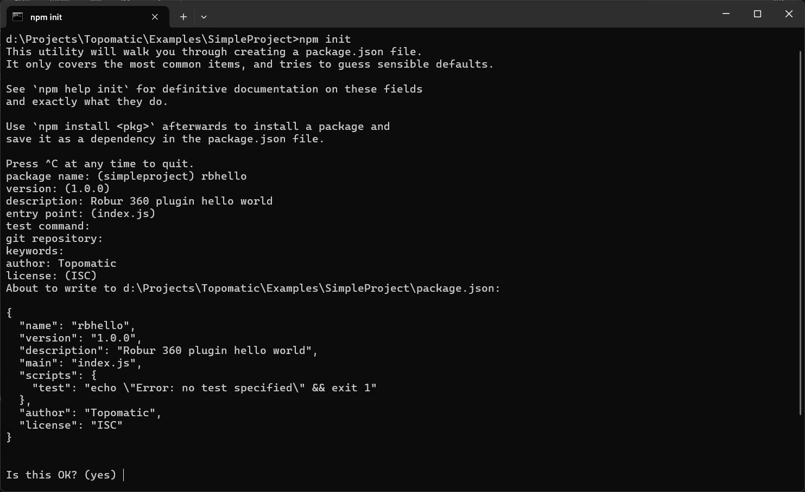
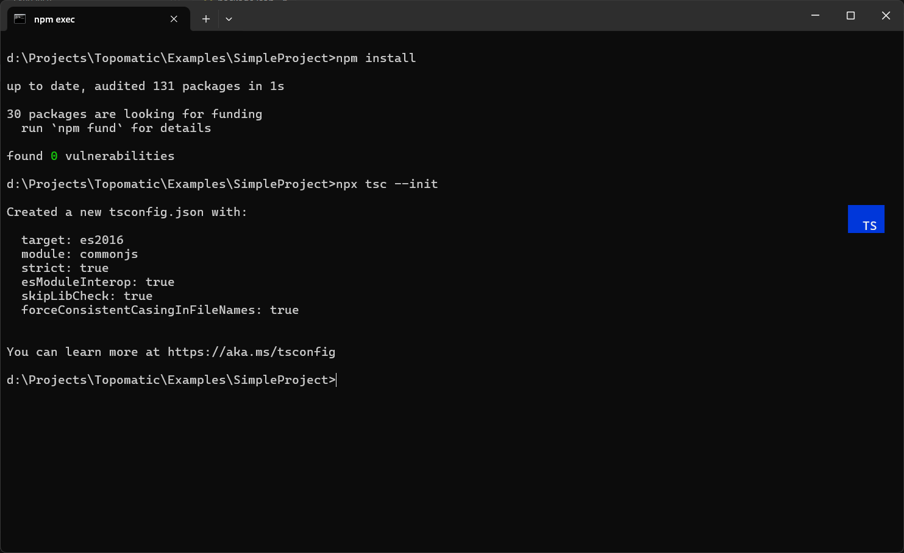
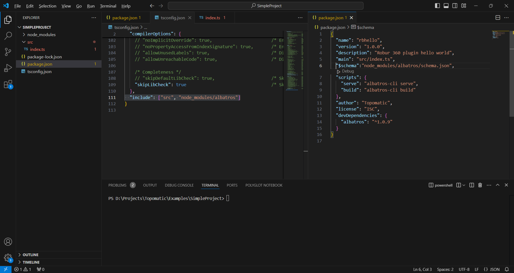

# Создание проекта

Создаем папку в которой будет вестись разработка. Открываем терминал из данной папки и вводим команду **npm init**. Заполняем предложенные поля по желанию:<br/><br/>



Далее необходимо открыть данную папку. В папке после создания будет только 1 файл **package.json**. 
Добавляем необходимые зависимости и устанавливаем их. 

В файл пакета **package.json** добавляем секцию **devDependency**:
```

  "devDependencies": {
    "albatros": "^1.0.9"
  }

```
Далее устанавливаем пакеты  (команды выполняются из папки проекта)
1. **npm install** - устанавливаем **albatros** и все зависимости
2. **npx tsc --init** - устанавливаем **Type Script**

<br/>



После выполнения команд будут добавлены конфигурационные файлы.

Далее необходимо создать папку для исходников плагина и точку входа. Папка **SRC** и файл **index.ts**. В файле **package.json** указываем к нему путь в разделе *main*
```
  "main": "src/index.ts",
```

Теперь необходимо подключить **albatros** в конфигурации *Type Script*. Для этого в конце конфига **tsconfig.json** добавляем:

```
  "include": ["src", "node_modules/albatros"]
```

Так же в файле **package.json** прописываем схему **albatros** и необходимые встроенные скрипты платформы
 
```
    "$schema":"node_modules/albatros/schema.json"
```
```
  "scripts": {
    "serve": "albatros-cli serve",
    "build": "albatros-cli build"
  }
```



## Код плагина

В файл описанный точкой входа, добавляем код функции которая будет вызвана при запуске плагина (в данном примере **Hello**).

```
export default{
    hello:(ctx: Context) => {
        ctx.showMessage("Привет мир!")
    }
}
```

Тип **Context** - описан в библиотеке **albatros**. Метод *[showMessage](../references/dialog_cmd.md#взаимодействия-с-пользователем)* выводит сообщение.

## Настройка Топоматик 360
### Регистрация команды <a name="head1">Heading One</a>

В файл **package.json** добавляем раздел **albatros**, него подраздел **[actions](../nav/command.md)**. В Visual Studio Code он создается автоматически по схеме. Заполняем его следующим образом: в разделе actions заполняем массив команд создаваемого плагина. *Рекомендовано называть их в соответствии с командами входной точки.*

```
"actions": {
      "ac_hello": {
        "label": "Привет мир!",
        "cmd": "hello",
        "description": "Команда вывода сообщения привет мир."
      }
    }
```

### Добавление команды в меню

Добавление команды в меню, осуществляется путем добавления раздела **[menu](../nav/menu.md)** в **package.json**  

```
    "menu": [
      {
        "label": "Hello",
       
        "submenu": [
          {
            "action": "ac_hello", 
            "label": "Show hello world!"
          }
        ]
      }
    ]
```
